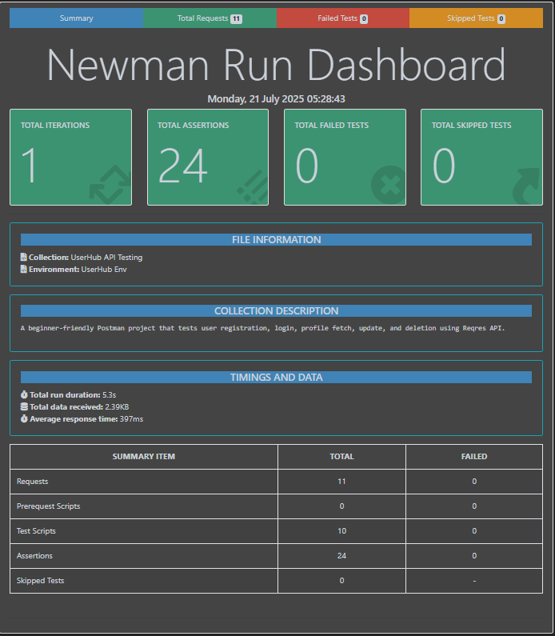

# 🧪 UserHub API Testing Project

A beginner-friendly Postman project that tests user registration, login, profile fetch, update, and deletion using the ReqRes API.

This project also includes a **Newman CLI** setup for automated testing and a beautiful **HTML report** using the `newman-reporter-htmlextra`.

```

## 📂 Project Structure

UserHub - NEWMAN report/
├── collection/
│ ├── UserHub API Testing.postman_collection.json
│ └── UserHub Environment.postman_environment.json
├── report.js
├── report.png
├── report.html
├── package.json
└── README.md

```

```

## ✅ What It Tests

| Action           | Description                              |
|------------------|------------------------------------------|
| Register User    | Positive and negative test cases         |
| Login User       | Successful & failed login flows          |
| Fetch User(s)    | Single user fetch and paginated results |
| Update Profile   | PATCH and PUT operations                 |
| Delete User      | Successful deletion                      |

```

## 🚀 Getting Started

### 1. Clone the Repository

```bash
git clone https://github.com/your-username/UserHub-API-Testing-Project.git
cd UserHub-API-Testing-Project
```
2. Install Dependencies
```
npm install
npm install -i newman-reporter-htmlextra
```
3. Run the Collection via Newman
```
node report.js
```
🧾 

